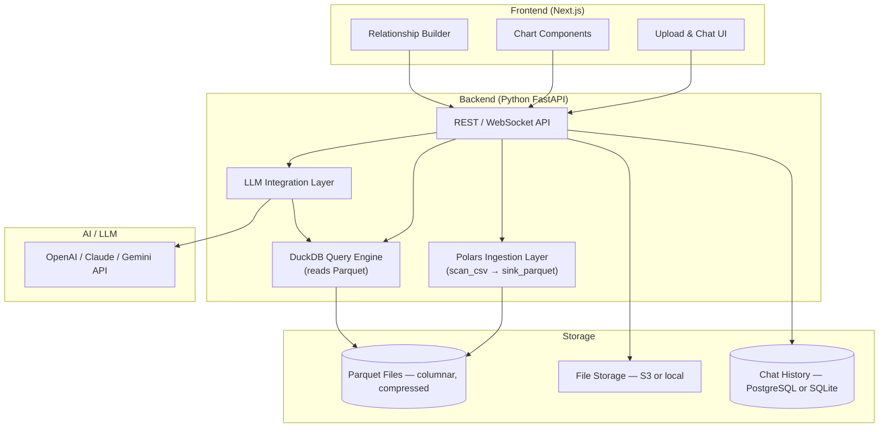
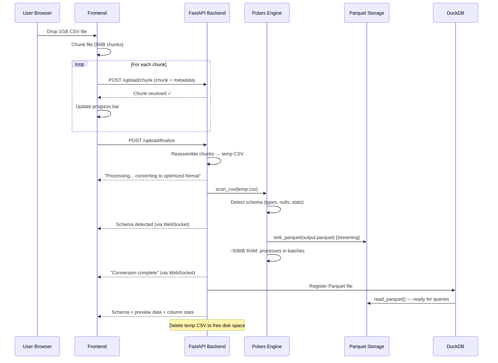
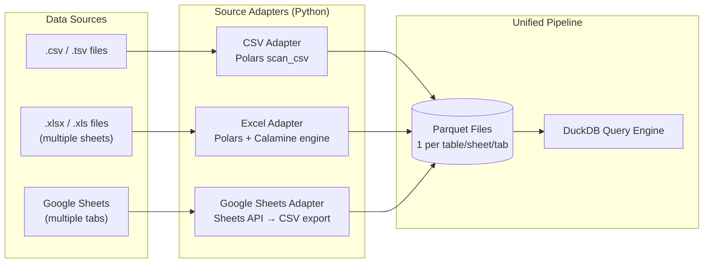
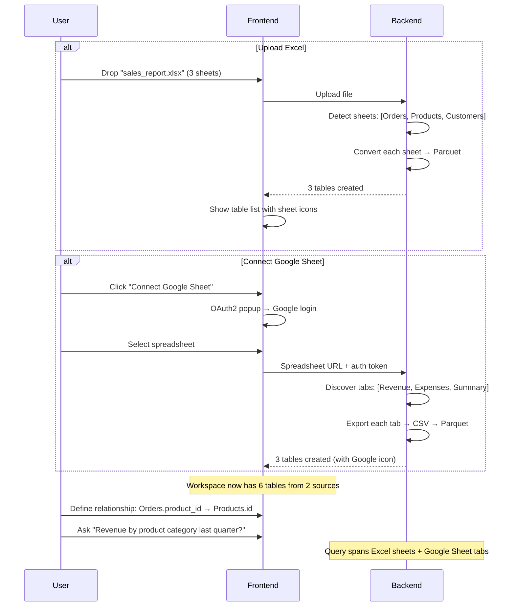
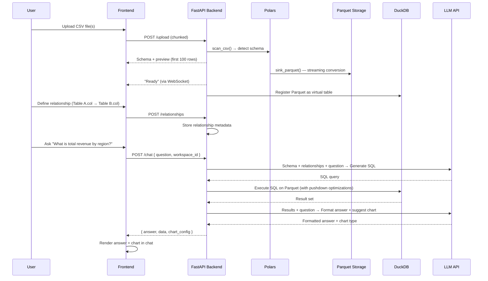

# CSV Reader AI — Product & Technical Plan

> **A conversational data platform where users upload CSVs, Excel files, or connect Google Sheets — define relationships across sources — and talk to their data using natural language.**

---

## 1. Why This Idea Works

| Strength | Detail |
|---|---|
| **Real pain point** | Non-technical users (marketers, ops, founders) constantly struggle to extract insights from CSV exports. Excel/Sheets are powerful but have a steep learning curve for complex queries. |
| **AI-native UX** | Chat is the most natural interface for ad-hoc data questions — no SQL, no formulas, no pivot-table wizardry. |
| **Multi-table relationships** | This is the killer differentiator. Most CSV-chat tools treat each file in isolation. Letting users **join** datasets unlocks 10× more insight (e.g., "show me revenue by region" when revenue is in one CSV and regions in another). |
| **Viral potential** | Upload → ask → share a chart. Short time-to-value drives word-of-mouth. |

---

## 2. Core Features

### Phase 1 — MVP (Talk to Your Data)

| # | Feature | Description |
|---|---------|-------------|
| 1 | **Multi-Source Upload** | Drag-and-drop or file picker. Support `.csv`, `.tsv`, `.xlsx`, `.xls`. Show upload progress. Each sheet in an Excel file becomes a separate table. |
| 2 | **Smart Schema Detection** | Auto-detect column types (string, number, date, boolean, email, URL, etc.). Let users override. |
| 3 | **Data Preview** | Interactive table showing first N rows with sorting, filtering, and search. Column stats (min, max, mean, nulls, unique count) on hover. |
| 4 | **Natural Language Chat** | A chat panel where users ask questions in plain English. The system translates to queries, executes them, and returns results as text, tables, or charts. |
| 5 | **Auto-Visualization** | When the answer is best shown visually (trends, distributions, comparisons), auto-generate charts (bar, line, pie, scatter). |
| 6 | **Export Results** | Download query results as CSV, or charts as PNG/SVG. |
| 7 | **Chat History** | Persist conversation per dataset so users can revisit past analyses. |

### Phase 2 — Multi-Source, Google Sheets & Relationships

| # | Feature | Description |
|---|---------|-------------|
| 8 | **Multi-file Upload** | Upload multiple files (CSV, Excel) into a single "workspace". Each file/sheet becomes a table. |
| 9 | **Google Sheets Connector** | OAuth2 "Connect Google Sheet" flow. Auto-discovers all tabs — each tab becomes a separate table. Supports re-sync to pull latest data. |
| 10 | **Relationship Builder** | Visual UI to define joins manually (drag-and-drop columns) or automatically via an auto-relationship detection engine (heuristics, value overlap, and semantic matching). Works across CSVs, Excel sheets, and Google Sheet tabs. |
| 11 | **Cross-table Queries** | "What is the average order value by customer segment?" where orders and customers come from *different sources* (e.g., one CSV + one Google Sheet tab). |
| 12 | **Schema Diagram** | A visual entity-relationship diagram showing tables from all sources and their connections. |

### Phase 3 — Power Features

| # | Feature | Description |
|---|---------|-------------|
| 13 | **Suggested Questions** | AI-generated starter questions based on schema analysis (e.g., "You have a `date` and `revenue` column — want to see revenue over time?"). |
| 14 | **Data Cleaning Assistant** | "I noticed 45 rows with missing `email`. Want me to drop them or fill with a default?" |
| 15 | **Saved Dashboards** | Pin favorite charts/answers into a persistent dashboard view. |
| 16 | **Shareable Links** | Generate a public or team-shared link to a workspace with read-only access. |
| 17 | **Scheduled Reports** | "Email me this chart every Monday." |
| 18 | **Google Sheets Live Sync** | Auto-refresh data from connected Google Sheets on a schedule or on-demand. |
| 19 | **API / Webhook** | Programmatic access for power users who want to integrate with other tools. |

---

## 3. Technical Architecture

### High-Level Architecture



### Key Technical Decisions

#### A. Ingestion Layer — Polars (CSV → Parquet)

| Option | Pros | Cons |
|--------|------|------|
| **Polars (lazy streaming)** | Blazing fast, handles larger-than-RAM files via `scan_csv` → `sink_parquet`, Rust-powered, zero-copy | Python-only for streaming (Node bindings are immature) |
| **Pandas** | Most popular, huge ecosystem | Memory-hungry (needs 2-5× file size in RAM), chokes on 1GB+ |
| **DuckDB direct CSV read** | Fast CSV reader, no conversion step | Re-parses CSV on every query, no columnar benefits |

> [!TIP]
> **Polars** is the clear winner for ingestion. Its lazy `scan_csv()` → `sink_parquet()` pipeline processes files in streaming batches — a 1GB CSV converts to Parquet using only ~50-100MB of RAM. This is the key to supporting large files.

#### B. Query Engine — DuckDB on Parquet

| Option | Pros | Cons |
|--------|------|------|
| **DuckDB (on Parquet)** | 3-10× faster than querying CSV, predicate/projection pushdown, parallel row-group scanning, zero infrastructure | Newer ecosystem |
| **DuckDB (on CSV)** | No conversion step needed | Must re-parse entire file every query, no column skipping |
| **SQLite** | Battle-tested | No native CSV/Parquet support, slower for analytics |

> [!IMPORTANT]
> **DuckDB + Parquet is the power combo.** DuckDB's `read_parquet()` leverages Parquet's columnar layout to skip irrelevant columns and row groups entirely. A query touching 3 of 100 columns reads only those 3 columns from disk.

#### C. LLM Strategy — Text-to-SQL

| Approach | How it works | Pros | Cons |
|----------|-------------|------|------|
| **Text-to-SQL** | LLM generates SQL from natural language + schema context | Deterministic execution, auditable, fast | Limited by SQL expressiveness |
| **Text-to-Code (Python)** | LLM generates pandas/DuckDB Python code | More flexible (ML, complex transforms) | Security risk (code execution), slower |
| **Hybrid** | SQL for simple queries, code for complex analysis | Best of both worlds | More complex to build |

> [!NOTE]
> **Start with Text-to-SQL for the MVP.** It's safer, faster, and covers 80%+ of user questions. Add code-execution (sandboxed) in a later phase for advanced analytics.

#### D. LLM Prompt Strategy

The core prompt engineering flow:

```
1. User asks: "What are the top 5 products by revenue?"

2. System constructs prompt:
   - Schema context: table names, columns, types, sample rows
   - Relationship context: how tables are joined
   - User question
   - Instructions: "Generate a DuckDB SQL query. Return ONLY the SQL."

3. LLM returns: SELECT product, SUM(revenue) as total FROM sales GROUP BY product ORDER BY total DESC LIMIT 5

4. System executes SQL against DuckDB on Parquet → returns results

5. System asks LLM to format/explain results in natural language + suggest visualization type
```

#### E. Auto-Relationship Detection Engine

An automated pipeline runs upon ingestion of new files or worksheets to discover potential table relationships. Rather than relying on simple string matches, it uses a three-tier matching system to calculate confidence scores:

1. **Heuristics & Name Analysis:** Analyzes column name suffix/prefix matches to detect common Primary Key (PK) & Foreign Key (FK) combinations (e.g., matching a table named `users` with primary key `id` to a column named `user_id` or `userId` in an `orders` table).
2. **Data-Profiling & Overlap Checking (DuckDB):** Performs in-memory queries using DuckDB to evaluate:
   - *Uniqueness:* Confirms if the candidate primary key column is indeed 100% unique.
   - *Inclusion Dependency:* Calculates the cardinality overlap ratio between the FK and PK columns ($\frac{|FK \cap PK|}{|FK|}$). A high overlap (e.g. >90%) indicates a strong relationship.
3. **Semantic LLM Matching:** For schemas with ambiguous naming conventions (e.g., matching a `cust_no` field to `ClientCode`), the metadata (tables, columns, and sample row values) is sent to the LLM to identify matches using semantic context.

Relationships are presented visually to the user as dashed glowing connector lines on the schema canvas with confidence scores, requiring manual approval to bind.

---

### Large File Handling Strategy (Polars + Parquet)

This is the critical architecture decision for supporting 1GB+ files. The pipeline is: **CSV → Polars (streaming) → Parquet (storage) → DuckDB (queries)**.

#### Why Parquet?

| Metric | CSV (1GB) | Parquet (same data) |
|--------|-----------|--------------------|
| **File size** | 1 GB | ~100-200 MB (5-10× compression) |
| **Query: SELECT 3/100 cols** | Must parse all 100 columns | Reads only 3 columns |
| **Query: WHERE price > 100** | Full table scan | Skips row groups via zone maps |
| **Query speed (analytical)** | Baseline | **3-10× faster** |
| **Parallelism** | Limited | Each row group = independent thread |

#### The Polars Streaming Pipeline

```python
import polars as pl

# WRONG — loads entire file into RAM (will OOM on 1GB+)
# df = pl.read_csv("huge_file.csv")

# RIGHT — lazy evaluation, streaming, constant memory
lazy_df = pl.scan_csv("huge_file.csv")

# Optional: apply transforms, filtering, type casting BEFORE writing
lazy_df = lazy_df.with_columns([
    pl.col("date").str.to_datetime(),
    pl.col("price").cast(pl.Float64),
])

# Stream to Parquet — processes in batches, never loads full file
lazy_df.sink_parquet(
    "output.parquet",
    compression="zstd",          # best compression ratio
    row_group_size=100_000,      # optimize for DuckDB parallel reads
)
```

> [!IMPORTANT]
> **Key insight**: `scan_csv()` creates a `LazyFrame` — it does NOT read the file. The actual processing happens only when `sink_parquet()` is called, and it processes in streaming batches. A 1GB CSV can be converted using only ~50-100MB of RAM.

#### Upload Pipeline — End to End



#### Tiered File Handling

| File Size | Strategy | UX |
|-----------|----------|----|
| **< 50 MB** | Direct upload, Polars `read_csv()` in-memory → `write_parquet()` | Instant — "Ready in 2 seconds" |
| **50 MB - 500 MB** | Chunked upload, Polars `scan_csv()` → `sink_parquet()` streaming | Progress bar — "Converting... 45%" |
| **500 MB - 2 GB** | Chunked upload, background async task, Polars streaming | Background job — "We'll notify you when ready" |
| **> 2 GB** | Reject or require paid tier | Error — "File too large for free tier" |

#### Schema Detection on Large Files

For a 1GB file, we don't need to scan the entire file to detect the schema:

```python
import polars as pl

# Read only first 10,000 rows for schema detection (instant)
schema_sample = pl.read_csv("huge_file.csv", n_rows=10_000)

# Extract schema info
schema_info = {
    col: {
        "dtype": str(schema_sample[col].dtype),
        "null_count": schema_sample[col].null_count(),
        "n_unique": schema_sample[col].n_unique(),
        "sample_values": schema_sample[col].head(5).to_list(),
    }
    for col in schema_sample.columns
}

# Use detected schema for the full streaming conversion
lazy_df = pl.scan_csv("huge_file.csv", dtypes=inferred_dtypes)
lazy_df.sink_parquet("output.parquet")
```

#### DuckDB Querying Parquet

Once the file is in Parquet format, DuckDB queries it directly — no loading step needed:

```python
import duckdb

con = duckdb.connect()  # in-memory, per-session

# Register parquet file as a virtual table
con.execute("""
    CREATE VIEW sales AS 
    SELECT * FROM read_parquet('workspace_123/sales.parquet')
""")

# Queries now benefit from Parquet optimizations automatically
result = con.execute("""
    SELECT region, SUM(revenue) as total_revenue
    FROM sales
    WHERE date >= '2024-01-01'
    GROUP BY region
    ORDER BY total_revenue DESC
""").fetchall()

# DuckDB automatically:
# ✓ Reads only 'region', 'revenue', 'date' columns (projection pushdown)
# ✓ Skips row groups where max(date) < '2024-01-01' (predicate pushdown)  
# ✓ Parallelizes across row groups (multi-threaded)
```

#### Memory Budget

| Component | Memory Usage (1GB CSV) |
|-----------|----------------------|
| Polars `scan_csv` | ~0 MB (lazy reference) |
| Polars `sink_parquet` streaming | ~50-100 MB (batch buffer) |
| Resulting Parquet file on disk | ~100-200 MB |
| DuckDB query execution | ~50-200 MB (depends on query) |
| **Total peak memory** | **~150-300 MB** for a 1GB file |

> [!CAUTION]
> **Never use `pl.read_csv()` or `pd.read_csv()` for large files.** These load the entire file into memory. A 1GB CSV needs ~2-5GB of RAM with Pandas. Always use `pl.scan_csv()` → `sink_parquet()` for files > 50MB.

---

### Multi-Source Ingestion Architecture

All sources (CSV, Excel, Google Sheets) normalize through a **unified pipeline** into Parquet. The query engine (DuckDB) only ever reads Parquet — it doesn't care where the data came from.



#### Source Adapter Details

##### 1. CSV / TSV Adapter

```python
import polars as pl

# Small files (< 50MB): direct read
df = pl.read_csv("data.csv")
df.write_parquet("workspace/data.parquet")

# Large files (> 50MB): streaming
pl.scan_csv("huge_data.csv").sink_parquet("workspace/data.parquet")
```

- One CSV = one Parquet file = one queryable table

##### 2. Excel Adapter (.xlsx / .xls)

```python
import polars as pl

# Use Calamine engine (Rust-based, 10x faster than openpyxl)
# Discover all sheets in the workbook
import openpyxl
wb = openpyxl.load_workbook("report.xlsx", read_only=True)
sheet_names = wb.sheetnames  # ['Sales', 'Inventory', 'Customers']
wb.close()

# Convert each sheet to a separate Parquet file
for sheet in sheet_names:
    df = pl.read_excel(
        "report.xlsx",
        sheet_name=sheet,
        engine="calamine",  # Rust-powered, blazing fast
    )
    df.write_parquet(f"workspace/{sheet}.parquet")
    # Each sheet becomes a separate table: Sales, Inventory, Customers
```

> [!TIP]
> **Each Excel sheet = a separate table in the workspace.** Upload one `.xlsx` with 5 sheets → get 5 queryable tables with auto-suggested relationships between them. This is a huge UX win.

| Engine | Speed (100K rows) | Notes |
|--------|-------------------|-------|
| **Calamine** (default) | ~0.3s | Rust-based, via `fastexcel` package, recommended |
| **openpyxl** | ~3.5s | Python-based, 10× slower, only for edge cases |
| **xlsx2csv** | ~1.2s | Converts to CSV first, then reads |

##### 3. Google Sheets Adapter

```python
import gspread
import polars as pl
from io import StringIO

# OAuth2 flow — user clicks "Connect Google Sheet" in the UI
gc = gspread.oauth()  # or service_account for server-side

# Open spreadsheet by URL that user provides
spreadsheet = gc.open_by_url("https://docs.google.com/spreadsheets/d/...")

# Discover all tabs (worksheets)
for worksheet in spreadsheet.worksheets():
    print(f"Importing tab: {worksheet.title}")
    
    # Fetch all data as CSV string
    csv_data = worksheet.get_all_values()
    
    # Convert to Polars DataFrame → Parquet
    if csv_data:
        headers = csv_data[0]
        rows = csv_data[1:]
        df = pl.DataFrame(rows, schema=headers, orient="row")
        df.write_parquet(f"workspace/{worksheet.title}.parquet")
        # Each tab becomes a separate table
```

> [!IMPORTANT]
> **Google Sheets flow**: User clicks "Connect Google Sheet" → OAuth popup → selects a spreadsheet → we auto-discover all tabs → each tab becomes a table → user can define relationships between tabs and other uploaded files.

#### The Multi-Sheet UX Flow



#### Unified Source Adapter (Code Architecture)

```python
from abc import ABC, abstractmethod
from typing import List, Tuple

class SourceAdapter(ABC):
    """Base class — all sources normalize to Parquet."""
    
    @abstractmethod
    def detect_tables(self) -> List[str]:
        """Return list of table names (sheets, tabs, or filename)."""
        pass
    
    @abstractmethod
    def ingest(self, workspace_path: str) -> List[Tuple[str, str]]:
        """Convert source → Parquet files. Returns [(table_name, parquet_path)]."""
        pass

class CSVAdapter(SourceAdapter):
    def detect_tables(self) -> List[str]:
        return [self.filename_without_ext]  # 1 CSV = 1 table
    
    def ingest(self, workspace_path: str) -> List[Tuple[str, str]]:
        # Polars scan_csv → sink_parquet (streaming for large files)
        ...

class ExcelAdapter(SourceAdapter):
    def detect_tables(self) -> List[str]:
        return self.sheet_names  # N sheets = N tables
    
    def ingest(self, workspace_path: str) -> List[Tuple[str, str]]:
        # Polars read_excel (calamine) per sheet → write_parquet
        ...

class GoogleSheetsAdapter(SourceAdapter):
    def detect_tables(self) -> List[str]:
        return self.tab_names  # N tabs = N tables
    
    def ingest(self, workspace_path: str) -> List[Tuple[str, str]]:
        # gspread → fetch data → Polars DataFrame → write_parquet
        ...
```

---

## 4. Proposed Tech Stack

| Layer | Technology | Why |
|-------|-----------|-----|
| **Frontend** | Next.js (App Router) + React | SSR, great DX, file-based routing |
| **Styling** | **Tailwind CSS v4** + Framer Motion | Enterprise-grade utility-first CSS; Framer Motion for smooth, orchestrated animations |
| **Charts** | [Recharts](https://recharts.org) or [Observable Plot](https://observablehq.com/plot/) | React-native charting, clean defaults |
| **Backend** | **Python (FastAPI)** | Required for Polars streaming — Node.js Polars bindings lack `sink_parquet` support |
| **CSV Ingestion** | **Polars** (`scan_csv` → `sink_parquet`) | Streaming CSV→Parquet with constant memory; Rust-powered performance |
| **Excel Ingestion** | **Polars + Calamine/fastexcel** | Rust-based Excel reader, 10× faster than openpyxl |
| **Google Sheets** | **gspread** + Google Sheets/Drive API | OAuth2, multi-tab discovery, CSV export per tab |
| **Storage Format** | **Apache Parquet** (Zstd compression) | 5-10× smaller than CSV, columnar, enables pushdown optimizations |
| **Query Engine** | **DuckDB** (Python `duckdb` package) | Blazing fast analytical SQL directly on Parquet files |
| **LLM** | OpenAI GPT-4o / Claude / Gemini (configurable) | Best-in-class text-to-SQL capabilities |
| **File Storage** | Local filesystem (MVP) → S3 (production) | Simple to start |
| **Chat Persistence** | SQLite (MVP) → PostgreSQL (production) | Lightweight, zero-config |
| **Task Queue** | Celery + Redis (for large file processing) | Background Parquet conversion for files > 500MB |
| **Deployment** | Vercel (frontend) + Railway/Render (backend) | Fast, cheap, auto-scaling |

---

## 5. UI/UX Concept — Enterprise Grade

> [!IMPORTANT]
> The UI must feel like a **premium SaaS product** — think Linear, Vercel Dashboard, or Raycast. Not a hackathon project. Every pixel matters.

### Design System

#### Typography
- **Primary font**: `Inter` (Google Fonts) — clean, modern, excellent readability
- **Monospace font**: `JetBrains Mono` — for SQL queries, code blocks, column names
- **Scale**: 12px (caption) → 14px (body) → 16px (subtitle) → 20px (title) → 28px (heading) → 36px (hero)

#### Color Palette (Dark Mode First)

```
┌─────────────────────────────────────────────────────┐
│  Background Layers (depth system)                   │
│  ─────────────────────────────────────               │
│  Base:     #09090b  (zinc-950)                      │
│  Surface:  #18181b  (zinc-900)                      │
│  Elevated: #27272a  (zinc-800)                      │
│  Overlay:  #3f3f46  (zinc-700)                      │
│                                                     │
│  Accent Colors                                      │
│  ─────────────────────────────────────               │
│  Primary:  #6366f1 → #818cf8  (indigo gradient)     │
│  Success:  #22c55e  (green-500)                      │
│  Warning:  #f59e0b  (amber-500)                      │
│  Error:    #ef4444  (red-500)                        │
│  Info:     #3b82f6  (blue-500)                       │
│                                                     │
│  Text                                               │
│  ─────────────────────────────────────               │
│  Primary:  #fafafa  (zinc-50)                       │
│  Secondary:#a1a1aa  (zinc-400)                      │
│  Muted:    #71717a  (zinc-500)                      │
│                                                     │
│  Source Badges                                      │
│  ─────────────────────────────────────               │
│  CSV:     #22c55e (green)                           │
│  Excel:   #16a34a (emerald)                         │
│  Google:  #4285f4 (Google blue)                     │
└─────────────────────────────────────────────────────┘
```

#### Glassmorphism & Depth

```css
/* Tailwind custom classes */
.glass-card {
  @apply bg-zinc-900/60 backdrop-blur-xl border border-zinc-700/50 
         rounded-2xl shadow-2xl shadow-black/20;
}

.glass-elevated {
  @apply bg-zinc-800/40 backdrop-blur-md border border-zinc-600/30 
         rounded-xl shadow-lg;
}

.glow-accent {
  @apply shadow-[0_0_30px_rgba(99,102,241,0.15)];
}
```

### Layout

```
┌──────────────────────────────────────────────────────────────┐
│  ░░ Header ░░░░░░░░░░░░░░░░░░░░░░░░░░░░░░░░░░░░░░░░░░░░░░  │
│  Logo  │  Workspace: "Sales Analysis"  │  ⚙ Settings  │ 👤  │
├────────────┬─────────────────────────────────────────────────┤
│            │                                                 │
│  Sidebar   │  ┌──────────────────────────────────────────┐   │
│  (240px)   │  │  Data Preview / Chart / Results           │   │
│            │  │  ┌──────┬──────┬──────┬──────┬──────┐     │   │
│ 📊 Tables  │  │  │ id   │ name │ rev  │ date │ ...  │     │   │
│  ├ Orders  │  │  ├──────┼──────┼──────┼──────┼──────┤     │   │
│  ├ Users   │  │  │ 1    │ Acme │ 4.5k │ Jan  │      │     │   │
│  └ Products│  │  │ 2    │ Beta │ 2.1k │ Feb  │      │     │   │
│            │  │  └──────┴──────┴──────┴──────┴──────┘     │   │
│ 🔗 Schema  │  └──────────────────────────────────────────┘   │
│            │                                                 │
│ 💬 Chats   │  ┌──────────────────────────────────────────┐   │
│  ├ Today   │  │  💬 Chat Panel (glass card)               │   │
│  ├ Yester..│  │                                           │   │
│  └ Apr 15  │  │  🤖 The average order value is $47.50.    │   │
│            │  │     Revenue has grown 23% this quarter.    │   │
│ ⚙ Settings │  │     ┌────────────────────────────┐         │   │
│            │  │     │ 📊 Revenue Trend Chart     │         │   │
│            │  │     │ ▁▂▃▅▆▇█▇▆▅▃▂▁            │         │   │
│            │  │     └────────────────────────────┘         │   │
│            │  │                                           │   │
│            │  │  ┌─────────────────────────────────────┐  │   │
│            │  │  │ 💬 Ask anything about your data...  │  │   │
│            │  │  └─────────────────────────────────────┘  │   │
│            │  └──────────────────────────────────────────┘   │
└────────────┴─────────────────────────────────────────────────┘
```

### Animation Specifications (Framer Motion)

| Element | Animation | Duration | Easing |
|---------|-----------|----------|--------|
| **Page transitions** | Fade + slide up (y: 10→0) | 300ms | `ease-out` |
| **Sidebar items** | Stagger fade-in on load | 50ms stagger | `ease-out` |
| **Data table rows** | Stagger fade-in from top | 30ms stagger | `ease-out` |
| **Chat messages** | Slide in from bottom + fade | 400ms | `spring(0.5, 0.8)` |
| **Charts** | Animate paths/bars on mount | 800ms | `ease-in-out` |
| **Upload dropzone** | Pulse border + scale on drag | 200ms | `spring` |
| **Skeleton loaders** | Shimmer gradient sweep | 1.5s loop | `linear` |
| **Toast notifications** | Slide in from top-right | 350ms | `spring(0.6, 0.9)` |
| **Modal/dialog** | Scale (0.95→1) + fade | 200ms | `ease-out` |
| **Button hover** | Scale 1.02 + subtle glow | 150ms | `ease-out` |
| **Tab switch** | Underline slide + content crossfade | 250ms | `ease-in-out` |

#### Chat Message Animation (Example)

```tsx
// Framer Motion orchestrated animation
const messageVariants = {
  hidden: { opacity: 0, y: 20, scale: 0.97 },
  visible: { 
    opacity: 1, y: 0, scale: 1,
    transition: { type: "spring", stiffness: 500, damping: 30 }
  }
};

// AI typing indicator — 3 bouncing dots
const typingDots = {
  animate: {
    y: [0, -6, 0],
    transition: { duration: 0.6, repeat: Infinity, delay: i * 0.15 }
  }
};
```

### Component-Level Design Specs

#### Upload Zone
```
┌─ ─ ─ ─ ─ ─ ─ ─ ─ ─ ─ ─ ─ ─ ─ ─ ─ ─ ─ ─ ─ ─ ─ ─┐
│                                                      │
│         ☁️  Drop your files here                     │
│                                                      │
│    Supports CSV, TSV, Excel (.xlsx, .xls)            │
│    Max 2GB per file                                  │
│                                                      │
│         [ Browse Files ]  [ Connect Google Sheet ]   │
│                                                      │
└─ ─ ─ ─ ─ ─ ─ ─ ─ ─ ─ ─ ─ ─ ─ ─ ─ ─ ─ ─ ─ ─ ─ ─┘

Tailwind: border-2 border-dashed border-zinc-700 hover:border-indigo-500
          bg-zinc-900/40 backdrop-blur-sm rounded-2xl
          transition-all duration-300

On drag-over: border-indigo-400, bg-indigo-500/5, scale-[1.01]
On uploading: animated gradient progress bar at bottom
```

#### Data Table
- **Header row**: `bg-zinc-800/80 sticky top-0 backdrop-blur-sm` — Frozen header with blur
- **Rows**: Alternating `bg-zinc-900/40` and `bg-transparent`, `hover:bg-zinc-800/60` with smooth transition
- **Column stats on hover**: Floating tooltip with mini sparkline, min/max/avg/nulls
- **Sort indicators**: Animated chevron rotation
- **Virtual scrolling**: Render only visible rows for performance on large datasets
- **Column type badges**: Colored pills (`text-xs rounded-full px-2 py-0.5`) — `#` for number, `Aa` for string, `📅` for date

#### Chat Panel
- **User messages**: Right-aligned, `bg-indigo-600/20 border border-indigo-500/30 rounded-2xl rounded-br-md`
- **AI messages**: Left-aligned, `bg-zinc-800/60 border border-zinc-700/50 rounded-2xl rounded-bl-md`
- **Inline SQL**: Syntax-highlighted code block with copy button, `bg-zinc-950 rounded-lg font-mono text-sm`
- **Inline charts**: Render directly in message bubble with subtle entrance animation
- **Input bar**: `bg-zinc-800/60 backdrop-blur-xl border border-zinc-700/50 rounded-2xl` — full-width with send button that pulses on focus
- **Suggested questions**: Horizontal scrollable chips above input, `bg-zinc-800 hover:bg-indigo-600/20 rounded-full text-sm`

#### Sidebar
- **Collapsible** with smooth width animation (240px → 64px icons-only)
- **Table list**: Source icon (CSV green / Excel emerald / GSheets blue) + table name + row count badge
- **Active item**: `bg-indigo-600/10 border-l-2 border-indigo-500`
- **Section headers**: Uppercase, `text-xs text-zinc-500 tracking-wider font-semibold`
- **Hover**: `bg-zinc-800/50` with 150ms transition

#### Schema Diagram
- **Interactive canvas** (React Flow or similar)
- **Table nodes**: Glass cards with column list
- **Relationship lines**: Animated dashed lines with directional arrow
- **Drag-to-connect**: Draw a line from column A to column B to create relationship
- **Color-coded by source**: Green border for CSV, emerald for Excel, blue for Google Sheets

### Design Inspiration

| Reference | What to borrow |
|-----------|---------------|
| **[Linear](https://linear.app)** | Ultra-clean dark UI, subtle animations, keyboard shortcuts |
| **[Vercel Dashboard](https://vercel.com/dashboard)** | Layout structure, data tables, deployment status cards |
| **[Raycast](https://raycast.com)** | Command palette UX, glass morphism, smooth transitions |
| **[Supabase Studio](https://supabase.com)** | Table editor, SQL panel, dark theme execution |

---

## 6. Frontend Components

### Component Tree

```
src/
├── app/                          # Next.js App Router
│   ├── layout.tsx                # Root layout (fonts, providers, theme)
│   ├── page.tsx                  # Landing / Upload page
│   ├── workspace/
│   │   └── [id]/
│   │       ├── page.tsx          # Main workspace view
│   │       └── schema/
│   │           └── page.tsx      # Schema diagram view
│   ├── settings/
│   │   └── page.tsx              # Settings / API keys page
│   └── auth/
│       ├── login/page.tsx        # OAuth login
│       └── callback/page.tsx     # OAuth callback
│
├── components/
│   ├── layout/                   # Page structure
│   ├── upload/                   # File upload flow
│   ├── data/                     # Data preview & tables
│   ├── chat/                     # Chat interface
│   ├── visualization/            # Charts & graphs
│   ├── relationships/            # Schema & joins
│   ├── settings/                 # Settings UI
│   └── shared/                   # Reusable primitives
│
├── hooks/                        # Custom React hooks
├── lib/                          # Utilities & API client
├── stores/                       # Zustand state stores
└── types/                        # TypeScript types
```

### All Components

#### 1. Layout Components

| Component | File | Description |
|-----------|------|-------------|
| `AppShell` | `layout/AppShell.tsx` | Root layout wrapper — sidebar + header + main content area. Handles responsive breakpoints. |
| `Header` | `layout/Header.tsx` | Top bar — logo, workspace name (editable), settings gear, user avatar dropdown. Glass blur background. |
| `Sidebar` | `layout/Sidebar.tsx` | Collapsible left panel (240px ↔ 64px). Contains table list, schema link, chat history, settings link. Animated width transition. |
| `SidebarSection` | `layout/SidebarSection.tsx` | Collapsible section within sidebar (Tables, Chats, etc.) with header + item list. |
| `SidebarItem` | `layout/SidebarItem.tsx` | Individual item — icon + label + badge. Source-colored icon (green CSV, emerald Excel, blue Google). Active state with indigo left border. |
| `MainContent` | `layout/MainContent.tsx` | Flex container for the main area — switches between data preview, chat, and schema views. |

#### 2. Upload Components

| Component | File | Description |
|-----------|------|-------------|
| `UploadZone` | `upload/UploadZone.tsx` | Full-page drag-and-drop zone. Dashed border, cloud icon, file type labels. Animated border color + scale on drag-over. Accepts `.csv`, `.tsv`, `.xlsx`, `.xls`. |
| `FileList` | `upload/FileList.tsx` | List of uploaded/uploading files with status indicators — file name, size, source type badge, progress/status. |
| `FileListItem` | `upload/FileListItem.tsx` | Single file row — icon, name, size, animated progress bar, status chip (uploading / processing / ready / error). |
| `UploadProgress` | `upload/UploadProgress.tsx` | Animated gradient progress bar for chunked uploads. Shows percentage + estimated time remaining. |
| `SheetSelector` | `upload/SheetSelector.tsx` | Shown after Excel upload — lists detected sheets with checkboxes. User can select which sheets to import. Toggle all / none. |
| `GoogleSheetConnect` | `upload/GoogleSheetConnect.tsx` | "Connect Google Sheet" button + modal. Triggers OAuth2 popup. Shows spreadsheet URL input + tab discovery list. *(Phase 2)* |

#### 3. Data Preview Components

| Component | File | Description |
|-----------|------|-------------|
| `DataTable` | `data/DataTable.tsx` | Main data table with virtual scrolling (for large datasets). Frozen header, sortable columns, horizontal scroll. |
| `ColumnHeader` | `data/ColumnHeader.tsx` | Column header cell — column name, type badge, sort arrow (animated rotation), click to sort. Hover to show stats popover. |
| `ColumnStatsPopover` | `data/ColumnStatsPopover.tsx` | Floating popover on column hover — shows min, max, mean, median, null count, unique count, mini distribution sparkline. |
| `DataTableRow` | `data/DataTableRow.tsx` | Single table row with alternating backgrounds. Supports row selection. |
| `DataTableToolbar` | `data/DataTableToolbar.tsx` | Above table — search input, column visibility toggle, row count display, export button. |
| `SchemaOverrideModal` | `data/SchemaOverrideModal.tsx` | Modal to manually override auto-detected column types. Dropdown per column (String, Number, Date, Boolean). |
| `TableSummaryCards` | `data/TableSummaryCards.tsx` | Row of stat cards above table — total rows, total columns, file size, null percentage. Animated count-up on mount. |

#### 4. Chat Components

| Component | File | Description |
|-----------|------|-------------|
| `ChatPanel` | `chat/ChatPanel.tsx` | Full chat interface — message list + input bar + suggested questions. Glass card container. |
| `MessageList` | `chat/MessageList.tsx` | Scrollable message container with auto-scroll to bottom. Staggered entry animation for new messages. |
| `UserMessage` | `chat/UserMessage.tsx` | Right-aligned chat bubble — user's question. Indigo-tinted glass background. |
| `AIMessage` | `chat/AIMessage.tsx` | Left-aligned chat bubble — AI response with rich content (text + optional SQL + optional chart + optional table). |
| `InlineChart` | `chat/InlineChart.tsx` | Chart rendered *inside* a chat message. Bar, line, pie, scatter. Animated entrance on mount. |
| `InlineTable` | `chat/InlineTable.tsx` | Small result table rendered inside a chat message. Max 20 rows with "show more" expand. |
| `SQLBlock` | `chat/SQLBlock.tsx` | Syntax-highlighted SQL code block (using `react-syntax-highlighter`). Copy button with checkmark animation. Toggle show/hide. |
| `TypingIndicator` | `chat/TypingIndicator.tsx` | Three bouncing dots animation while AI is thinking/generating. |
| `SuggestedQuestions` | `chat/SuggestedQuestions.tsx` | Horizontal scrollable chip list above input. AI-generated based on schema. Click to auto-fill input. |
| `ChatInput` | `chat/ChatInput.tsx` | Input bar with auto-resize textarea, send button (animated on focus), keyboard shortcut hint (⌘+Enter). |
| `ChatHistoryList` | `chat/ChatHistoryList.tsx` | List of past conversations in sidebar. Grouped by date (Today, Yesterday, etc.). Click to load. |

#### 5. Visualization Components

| Component | File | Description |
|-----------|------|-------------|
| `ChartRenderer` | `visualization/ChartRenderer.tsx` | Smart chart wrapper — receives data + chart type from API and renders the correct chart component. |
| `BarChart` | `visualization/BarChart.tsx` | Animated bar chart via Recharts. Bars grow from bottom on mount. Hover tooltip. |
| `LineChart` | `visualization/LineChart.tsx` | Animated line chart — line draws from left to right on mount. Area fill option. |
| `PieChart` | `visualization/PieChart.tsx` | Animated pie/donut chart — segments expand from center. Legend with color-coded labels. |
| `ScatterPlot` | `visualization/ScatterPlot.tsx` | Scatter plot with animated dot entrance. Hover for point details. |
| `ChartExportButton` | `visualization/ChartExportButton.tsx` | Button to download chart as PNG/SVG. Uses html2canvas. |

#### 6. Relationship Components *(Phase 2)*

| Component | File | Description |
|-----------|------|-------------|
| `SchemaCanvas` | `relationships/SchemaCanvas.tsx` | Interactive canvas (React Flow) showing all tables as nodes and relationships as edges. Pan, zoom, drag. |
| `TableNode` | `relationships/TableNode.tsx` | Single table node on canvas — table name, source badge, column list. Color-coded border by source. |
| `RelationshipLine` | `relationships/RelationshipLine.tsx` | Animated dashed line connecting two columns. Arrow showing join direction. |
| `RelationshipModal` | `relationships/RelationshipModal.tsx` | Modal to create/edit a relationship — select Table A column → Table B column. Join type dropdown (inner, left, right). |
| `AutoSuggestRelationships` | `relationships/AutoSuggestRelationships.tsx` | Banner/toast suggesting auto-detected relationships based on matching column names/types. |

#### 7. Settings Components

| Component | File | Description |
|-----------|------|-------------|
| `SettingsPanel` | `settings/SettingsPanel.tsx` | Full settings page layout — tabs for API Keys, Profile, Preferences. |
| `APIKeyInput` | `settings/APIKeyInput.tsx` | Masked input for API key entry. Show/hide toggle. Validation indicator (green check / red x). |
| `ProviderSelector` | `settings/ProviderSelector.tsx` | Radio/button group to select LLM provider — OpenAI, Claude, Gemini. Shows model options per provider. |
| `ProfileCard` | `settings/ProfileCard.tsx` | User profile display — avatar, name, email, OAuth provider badge. Logout button. |

#### 8. Shared / Primitive Components

| Component | File | Description |
|-----------|------|-------------|
| `GlassCard` | `shared/GlassCard.tsx` | Reusable glass-morphism container. `bg-zinc-900/60 backdrop-blur-xl border border-zinc-700/50 rounded-2xl`. |
| `Toast` | `shared/Toast.tsx` | Notification toast — slides in from top-right. Success (green), error (red), info (blue), warning (amber). Auto-dismiss. |
| `Modal` | `shared/Modal.tsx` | Centered modal dialog with backdrop blur. Scale + fade entrance animation. Escape to close. |
| `SkeletonLoader` | `shared/SkeletonLoader.tsx` | Shimmer loading placeholder. Variants: text line, table row, card, chart. |
| `Badge` | `shared/Badge.tsx` | Small colored pill — for source type, column type, status. Variants: `default`, `success`, `warning`, `error`. |
| `EmptyState` | `shared/EmptyState.tsx` | Illustrated empty state with title + description + CTA button. Used when no data/no chats. |
| `Tooltip` | `shared/Tooltip.tsx` | Hover tooltip with arrow. Position-aware (auto flip). |
| `ConfirmDialog` | `shared/ConfirmDialog.tsx` | Destructive action confirmation — "Delete this workspace?" with cancel/confirm buttons. |
| `Spinner` | `shared/Spinner.tsx` | Animated loading spinner with size variants (sm, md, lg). |
| `SourceIcon` | `shared/SourceIcon.tsx` | Returns correct icon + color for a data source (CSV, Excel, Google Sheets). |

### Key Custom Hooks

| Hook | File | Purpose |
|------|------|---------|
| `useWorkspace` | `hooks/useWorkspace.ts` | Manages current workspace state — tables, relationships, active table. |
| `useChat` | `hooks/useChat.ts` | Chat state management — messages, send message, loading state, streaming. |
| `useUpload` | `hooks/useUpload.ts` | Chunked file upload with progress tracking. Handles drag-and-drop events. |
| `useWebSocket` | `hooks/useWebSocket.ts` | WebSocket connection for real-time updates (upload progress, query status). |
| `useDataTable` | `hooks/useDataTable.ts` | Table state — sorting, column visibility, virtual scroll position, search. |
| `useSettings` | `hooks/useSettings.ts` | API key management — save, load, validate, select provider. |

### State Management (Zustand Stores)

| Store | File | State |
|-------|------|-------|
| `workspaceStore` | `stores/workspace.ts` | Current workspace, tables list, active table, schema metadata |
| `chatStore` | `stores/chat.ts` | Messages, conversation history, loading state, suggested questions |
| `uploadStore` | `stores/upload.ts` | Upload queue, per-file progress, processing status |
| `settingsStore` | `stores/settings.ts` | LLM provider, API keys, user preferences |
| `uiStore` | `stores/ui.ts` | Sidebar collapsed, active view (data/chat/schema), modals open |

---

## 7. Backend API Specification

### Base URL: `/api/v1`

### Authentication

| Method | Endpoint | Description | Request | Response |
|--------|----------|-------------|---------|----------|
| `GET` | `/auth/providers` | List available OAuth providers | — | `{ providers: ["google", "github"] }` |
| `GET` | `/auth/{provider}/login` | Redirect to OAuth provider login | — | `302 redirect to provider` |
| `GET` | `/auth/{provider}/callback` | Handle OAuth callback | `?code=...&state=...` | `{ token, user }` |
| `GET` | `/auth/me` | Get current user info | `Authorization: Bearer <token>` | `{ id, name, email, avatar, provider }` |
| `POST` | `/auth/logout` | Invalidate session | `Authorization: Bearer <token>` | `{ success: true }` |

---

### Upload & Ingestion

| Method | Endpoint | Description | Request | Response |
|--------|----------|-------------|---------|----------|
| `POST` | `/upload` | Upload a small file (< 50MB) directly | `multipart/form-data: file, workspace_id` | `{ tables: [{ name, columns, row_count, source_type }] }` |
| `POST` | `/upload/chunk` | Upload a single chunk for large files | `multipart/form-data: chunk, upload_id, chunk_index, total_chunks, filename` | `{ chunk_index, received: true }` |
| `POST` | `/upload/init` | Initialize a chunked upload | `{ filename, file_size, workspace_id }` | `{ upload_id, chunk_size: 5242880 }` |
| `POST` | `/upload/finalize` | Finalize chunked upload, trigger ingestion | `{ upload_id }` | `{ status: "processing", task_id }` |
| `GET` | `/upload/status/{task_id}` | Poll processing status | — | `{ status: "processing\|complete\|error", progress: 0.65, tables?: [...] }` |

---

### Workspaces & Tables

| Method | Endpoint | Description | Request | Response |
|--------|----------|-------------|---------|----------|
| `POST` | `/workspaces` | Create a new workspace | `{ name }` | `{ id, name, created_at }` |
| `GET` | `/workspaces` | List user's workspaces | — | `{ workspaces: [{ id, name, table_count, created_at }] }` |
| `GET` | `/workspaces/{id}` | Get workspace with all tables | — | `{ id, name, tables: [...], relationships: [...] }` |
| `DELETE` | `/workspaces/{id}` | Delete workspace + all data | — | `{ success: true }` |
| `PUT` | `/workspaces/{id}` | Update workspace name | `{ name }` | `{ id, name }` |
| `GET` | `/workspaces/{id}/tables` | List tables in workspace | — | `{ tables: [{ name, columns, row_count, source_type, file_size }] }` |
| `GET` | `/workspaces/{id}/tables/{table}` | Get table schema + preview | `?rows=100` | `{ name, columns: [{ name, dtype, stats }], preview: [[...rows]], total_rows }` |
| `DELETE` | `/workspaces/{id}/tables/{table}` | Delete a single table | — | `{ success: true }` |

---

### Chat & Querying

| Method | Endpoint | Description | Request | Response |
|--------|----------|-------------|---------|----------|
| `POST` | `/workspaces/{id}/chat` | Send a question | `{ message, conversation_id? }` | `{ answer, sql, data?, chart_config?, conversation_id }` |
| `GET` | `/workspaces/{id}/conversations` | List chat history | — | `{ conversations: [{ id, title, last_message, created_at }] }` |
| `GET` | `/workspaces/{id}/conversations/{conv_id}` | Get full conversation | — | `{ id, messages: [{ role, content, sql?, data?, chart? }] }` |
| `DELETE` | `/workspaces/{id}/conversations/{conv_id}` | Delete a conversation | — | `{ success: true }` |
| `GET` | `/workspaces/{id}/suggestions` | Get AI-suggested questions | — | `{ suggestions: ["Top 5 products by revenue?", ...] }` |
| `POST` | `/workspaces/{id}/query` | Execute raw SQL (advanced) | `{ sql }` | `{ columns, data, row_count, execution_time_ms }` |

---

### Relationships *(Phase 2)*

| Method | Endpoint | Description | Request | Response |
|--------|----------|-------------|---------|----------|
| `POST` | `/workspaces/{id}/relationships` | Create a relationship | `{ table_a, column_a, table_b, column_b, join_type }` | `{ id, table_a, column_a, table_b, column_b, join_type }` |
| `GET` | `/workspaces/{id}/relationships` | List all relationships | — | `{ relationships: [...] }` |
| `DELETE` | `/workspaces/{id}/relationships/{rel_id}` | Delete a relationship | — | `{ success: true }` |
| `GET` | `/workspaces/{id}/relationships/suggest` | Auto-suggest relationships | — | `{ suggestions: [{ table_a, column_a, table_b, column_b, confidence }] }` |

---

### Settings

| Method | Endpoint | Description | Request | Response |
|--------|----------|-------------|---------|----------|
| `GET` | `/settings` | Get user settings | — | `{ llm_provider, has_api_key: true, ... }` |
| `PUT` | `/settings` | Update settings | `{ llm_provider, api_key? }` | `{ success: true }` |
| `POST` | `/settings/validate-key` | Test if API key works | `{ provider, api_key }` | `{ valid: true, model: "gpt-4o" }` |

---

### WebSocket

| Endpoint | Direction | Events |
|----------|-----------|--------|
| `ws://host/ws/{workspace_id}` | Server → Client | `upload_progress: { file, progress, status }` |
| | Server → Client | `ingestion_complete: { table_name, row_count, columns }` |
| | Server → Client | `chat_stream: { token, done: false }` |
| | Server → Client | `chat_complete: { answer, sql, data, chart_config }` |
| | Server → Client | `error: { code, message }` |
| | Client → Server | `chat_message: { message, conversation_id }` |

### Backend File Structure

```
backend/
├── main.py                       # FastAPI app entry point
├── config.py                     # Settings, env vars
├── requirements.txt
│
├── api/                          # Route handlers
│   ├── auth.py                   # OAuth routes
│   ├── upload.py                 # File upload routes
│   ├── workspaces.py             # Workspace CRUD
│   ├── tables.py                 # Table preview & schema
│   ├── chat.py                   # Chat & query routes
│   ├── relationships.py          # Relationship CRUD
│   ├── settings.py               # User settings
│   └── websocket.py              # WebSocket handler
│
├── services/                     # Business logic
│   ├── ingestion/
│   │   ├── base.py               # SourceAdapter ABC
│   │   ├── csv_adapter.py        # CSV/TSV → Parquet
│   │   ├── excel_adapter.py      # Excel → Parquet (per sheet)
│   │   └── gsheet_adapter.py     # Google Sheets → Parquet
│   ├── query_engine.py           # DuckDB query execution
│   ├── llm_service.py            # LLM integration (text-to-SQL)
│   ├── schema_detector.py        # Column type detection + stats
│   └── chat_service.py           # Conversation management
│
├── models/                       # DB models (SQLAlchemy)
│   ├── user.py
│   ├── workspace.py
│   ├── table_meta.py
│   ├── relationship.py
│   └── conversation.py
│
├── schemas/                      # Pydantic request/response models
│   ├── auth.py
│   ├── upload.py
│   ├── workspace.py
│   ├── chat.py
│   └── settings.py
│
└── utils/
    ├── auth.py                   # JWT token handling
    ├── storage.py                # File storage (local / S3)
    └── encryption.py             # API key encryption
```

---

## 8. Python Backend — Enterprise Coding Standards

> [!IMPORTANT]
> The backend must follow **enterprise-grade coding practices**. Clean, maintainable, testable code is non-negotiable. Every file should read like well-written documentation.

### Core Principles

| Principle | Rule | Example |
|-----------|------|---------|
| **DRY** (Don't Repeat Yourself) | Extract shared logic into services/utils. Never copy-paste. | Schema detection logic lives in ONE `schema_detector.py`, used by all adapters. |
| **SOLID** | Single Responsibility, Open/Closed, Liskov, Interface Segregation, Dependency Inversion | Each service class does ONE thing. `SourceAdapter` ABC allows adding new sources without modifying existing code. |
| **KISS** (Keep It Simple) | Prefer simple, readable code over clever one-liners. | Use explicit loops over nested comprehensions when readability suffers. |
| **YAGNI** (You Aren't Gonna Need It) | Don't build features / abstractions until needed. | Don't add database sharding logic for MVP. |
| **Separation of Concerns** | Routes → Services → Repositories → Models. No business logic in route handlers. | Route handler calls `chat_service.process_question()`, never touches DuckDB directly. |
| **Fail Fast** | Validate input early. Raise meaningful errors immediately. | Validate file type at upload start, not after 500MB transfer. |

### Type Hints — Everywhere

```python
# ❌ BAD — No type hints, unclear what goes in / comes out
def process_file(file, workspace):
    data = read_file(file)
    return save(data, workspace)

# ✅ GOOD — Fully typed, self-documenting
async def process_file(
    file: UploadFile,
    workspace_id: UUID,
    adapter: SourceAdapter,
) -> list[TableMetadata]:
    """Ingest uploaded file and convert to Parquet format.
    
    Args:
        file: The uploaded file (CSV, Excel, etc.)
        workspace_id: Target workspace UUID
        adapter: Source-specific adapter for ingestion
        
    Returns:
        List of created table metadata objects
        
    Raises:
        FileValidationError: If file type or size is invalid
        IngestionError: If Polars conversion fails
    """
    validated = await validate_upload(file)
    tables = await adapter.ingest(validated, workspace_id)
    return tables
```

### Layered Architecture

```
Request Flow:

    Client Request
         │
         ▼
┌─────────────────┐
│   API Routes    │  ← Thin layer: parse request, call service, return response
│   (api/*.py)    │  ← NO business logic here
└────────┬────────┘
         │
         ▼
┌─────────────────┐
│   Services      │  ← ALL business logic here
│ (services/*.py) │  ← Orchestrates repositories, adapters, external APIs
└────────┬────────┘
         │
         ▼
┌─────────────────┐
│  Repositories   │  ← Data access layer (DB queries)
│ (repos/*.py)    │  ← ONLY database operations, no logic
└────────┬────────┘
         │
         ▼
┌─────────────────┐
│   Models        │  ← SQLAlchemy ORM models
│ (models/*.py)   │  ← Schema definition only
└─────────────────┘
```

#### Route Handler (Thin)

```python
# api/chat.py — Route handlers are THIN
from fastapi import APIRouter, Depends
from schemas.chat import ChatRequest, ChatResponse
from services.chat_service import ChatService

router = APIRouter(prefix="/workspaces/{workspace_id}", tags=["chat"])

@router.post("/chat", response_model=ChatResponse)
async def send_message(
    workspace_id: UUID,
    request: ChatRequest,
    chat_service: ChatService = Depends(get_chat_service),  # Dependency Injection
    current_user: User = Depends(get_current_user),
) -> ChatResponse:
    """Send a natural language question and get an AI-powered answer."""
    # Route handler does ONE thing: delegate to service
    return await chat_service.process_question(
        workspace_id=workspace_id,
        message=request.message,
        conversation_id=request.conversation_id,
        user=current_user,
    )
```

#### Service Layer (Business Logic)

```python
# services/chat_service.py — ALL business logic lives here
class ChatService:
    """Orchestrates the natural language → SQL → results pipeline."""
    
    def __init__(
        self,
        llm_service: LLMService,
        query_engine: QueryEngine,
        workspace_repo: WorkspaceRepository,
        conversation_repo: ConversationRepository,
    ) -> None:
        self._llm = llm_service
        self._query = query_engine
        self._workspaces = workspace_repo
        self._conversations = conversation_repo

    async def process_question(
        self,
        workspace_id: UUID,
        message: str,
        conversation_id: UUID | None,
        user: User,
    ) -> ChatResponse:
        # 1. Get workspace context
        workspace = await self._workspaces.get_with_tables(workspace_id)
        if not workspace:
            raise WorkspaceNotFoundError(workspace_id)

        # 2. Build schema context for LLM
        schema_context = self._build_schema_context(workspace)

        # 3. Generate SQL from natural language
        sql_result = await self._llm.text_to_sql(
            question=message,
            schema=schema_context,
            dialect="duckdb",
        )

        # 4. Execute SQL safely
        query_result = await self._query.execute_safe(
            workspace_id=workspace_id,
            sql=sql_result.sql,
        )

        # 5. Format response with LLM
        answer = await self._llm.format_answer(
            question=message,
            sql=sql_result.sql,
            data=query_result.data,
        )

        # 6. Persist conversation
        conversation = await self._conversations.add_message(
            conversation_id=conversation_id,
            workspace_id=workspace_id,
            user_id=user.id,
            question=message,
            answer=answer,
            sql=sql_result.sql,
        )

        return ChatResponse(
            answer=answer.text,
            sql=sql_result.sql,
            data=query_result.data,
            chart_config=answer.chart_config,
            conversation_id=conversation.id,
        )
```

### Error Handling — Custom Exception Hierarchy

```python
# exceptions.py — Structured, typed exceptions
class AppError(Exception):
    """Base exception for all application errors."""
    
    def __init__(self, message: str, code: str, status_code: int = 500) -> None:
        self.message = message
        self.code = code
        self.status_code = status_code
        super().__init__(message)


# Domain-specific exceptions
class FileValidationError(AppError):
    """Raised when uploaded file fails validation."""
    def __init__(self, reason: str) -> None:
        super().__init__(
            message=f"File validation failed: {reason}",
            code="FILE_VALIDATION_ERROR",
            status_code=400,
        )

class FileTooLargeError(FileValidationError):
    def __init__(self, size_mb: float, max_mb: float = 2048) -> None:
        super().__init__(f"File size {size_mb:.0f}MB exceeds limit of {max_mb:.0f}MB")

class UnsupportedFileTypeError(FileValidationError):
    def __init__(self, file_type: str) -> None:
        super().__init__(f"Unsupported file type: {file_type}")

class WorkspaceNotFoundError(AppError):
    def __init__(self, workspace_id: UUID) -> None:
        super().__init__(
            message=f"Workspace {workspace_id} not found",
            code="WORKSPACE_NOT_FOUND",
            status_code=404,
        )

class QueryExecutionError(AppError):
    def __init__(self, sql: str, reason: str) -> None:
        super().__init__(
            message=f"Query execution failed: {reason}",
            code="QUERY_EXECUTION_ERROR",
            status_code=422,
        )

class LLMProviderError(AppError):
    def __init__(self, provider: str, reason: str) -> None:
        super().__init__(
            message=f"LLM provider '{provider}' error: {reason}",
            code="LLM_PROVIDER_ERROR",
            status_code=502,
        )


# Global exception handler in FastAPI
@app.exception_handler(AppError)
async def handle_app_error(request: Request, exc: AppError) -> JSONResponse:
    return JSONResponse(
        status_code=exc.status_code,
        content={"error": exc.code, "message": exc.message},
    )
```

### Pydantic Schemas — All Request/Response Validated

```python
# schemas/chat.py — Strict validation, clear contracts
from pydantic import BaseModel, Field
from uuid import UUID
from datetime import datetime
from enum import Enum

class ChartType(str, Enum):
    BAR = "bar"
    LINE = "line"
    PIE = "pie"
    SCATTER = "scatter"

class ChatRequest(BaseModel):
    """Request schema for sending a chat message."""
    message: str = Field(..., min_length=1, max_length=5000, description="User's question")
    conversation_id: UUID | None = Field(None, description="Existing conversation to continue")

    model_config = {"json_schema_extra": {
        "example": {"message": "What are the top 5 products by revenue?"}
    }}

class ChartConfig(BaseModel):
    chart_type: ChartType
    x_axis: str
    y_axis: str
    title: str

class ChatResponse(BaseModel):
    """Response schema for a chat answer."""
    answer: str
    sql: str
    data: list[dict] | None = None
    chart_config: ChartConfig | None = None
    conversation_id: UUID
    execution_time_ms: int
```

### Dependency Injection (FastAPI `Depends`)

```python
# dependencies.py — Centralized DI wiring
from functools import lru_cache
from fastapi import Depends
from sqlalchemy.ext.asyncio import AsyncSession

async def get_db_session() -> AsyncGenerator[AsyncSession, None]:
    """Yield a database session, auto-commit/rollback."""
    async with async_session_maker() as session:
        try:
            yield session
            await session.commit()
        except Exception:
            await session.rollback()
            raise

def get_workspace_repo(
    session: AsyncSession = Depends(get_db_session),
) -> WorkspaceRepository:
    return WorkspaceRepository(session)

def get_query_engine() -> QueryEngine:
    return QueryEngine(parquet_base_path=settings.PARQUET_STORAGE_PATH)

def get_llm_service(
    settings_repo: SettingsRepository = Depends(get_settings_repo),
) -> LLMService:
    return LLMService(settings_repo=settings_repo)

def get_chat_service(
    llm: LLMService = Depends(get_llm_service),
    query: QueryEngine = Depends(get_query_engine),
    workspace_repo: WorkspaceRepository = Depends(get_workspace_repo),
    conversation_repo: ConversationRepository = Depends(get_conversation_repo),
) -> ChatService:
    """Fully wired ChatService with all dependencies injected."""
    return ChatService(
        llm_service=llm,
        query_engine=query,
        workspace_repo=workspace_repo,
        conversation_repo=conversation_repo,
    )
```

### Repository Pattern (Data Access)

```python
# repos/workspace_repo.py — ONLY data access, no business logic
class WorkspaceRepository:
    """Data access layer for workspaces."""
    
    def __init__(self, session: AsyncSession) -> None:
        self._session = session

    async def create(self, name: str, user_id: UUID) -> Workspace:
        workspace = Workspace(name=name, user_id=user_id)
        self._session.add(workspace)
        await self._session.flush()
        return workspace

    async def get_by_id(self, workspace_id: UUID) -> Workspace | None:
        return await self._session.get(Workspace, workspace_id)

    async def get_with_tables(self, workspace_id: UUID) -> Workspace | None:
        stmt = (
            select(Workspace)
            .options(selectinload(Workspace.tables))
            .where(Workspace.id == workspace_id)
        )
        result = await self._session.execute(stmt)
        return result.scalar_one_or_none()

    async def list_by_user(self, user_id: UUID) -> list[Workspace]:
        stmt = (
            select(Workspace)
            .where(Workspace.user_id == user_id)
            .order_by(Workspace.created_at.desc())
        )
        result = await self._session.execute(stmt)
        return list(result.scalars().all())

    async def delete(self, workspace_id: UUID) -> None:
        stmt = delete(Workspace).where(Workspace.id == workspace_id)
        await self._session.execute(stmt)
```

### Configuration — Environment-Based (Pydantic Settings)

```python
# config.py — Type-safe, validated configuration
from pydantic_settings import BaseSettings
from functools import lru_cache

class Settings(BaseSettings):
    """Application settings loaded from environment variables."""
    
    # App
    APP_NAME: str = "CSV Reader AI"
    DEBUG: bool = False
    API_VERSION: str = "v1"
    
    # Database
    DATABASE_URL: str = "sqlite+aiosqlite:///./data/app.db"
    
    # Storage
    PARQUET_STORAGE_PATH: str = "./data/parquets"
    MAX_UPLOAD_SIZE_MB: int = 2048
    CHUNK_SIZE_BYTES: int = 5_242_880  # 5MB
    
    # Auth
    JWT_SECRET: str
    JWT_ALGORITHM: str = "HS256"
    JWT_EXPIRY_HOURS: int = 24
    OAUTH_GOOGLE_CLIENT_ID: str = ""
    OAUTH_GOOGLE_CLIENT_SECRET: str = ""
    
    # Encryption (for API key storage)
    ENCRYPTION_KEY: str
    
    # CORS
    ALLOWED_ORIGINS: list[str] = ["http://localhost:3000"]
    
    model_config = {"env_file": ".env", "env_file_encoding": "utf-8"}

@lru_cache
def get_settings() -> Settings:
    return Settings()
```

### Logging — Structured, Contextual

```python
# utils/logging.py — Structured JSON logging
import structlog
from uuid import UUID

logger = structlog.get_logger()

# Usage in services:
class ChatService:
    async def process_question(self, workspace_id: UUID, message: str, ...) -> ChatResponse:
        log = logger.bind(
            workspace_id=str(workspace_id),
            user_id=str(user.id),
            action="process_question",
        )
        
        log.info("Processing question", message_length=len(message))
        
        try:
            sql_result = await self._llm.text_to_sql(...)
            log.info("SQL generated", sql=sql_result.sql)
            
            query_result = await self._query.execute_safe(...)
            log.info("Query executed", rows=query_result.row_count, time_ms=query_result.time_ms)
            
        except QueryExecutionError as e:
            log.error("Query failed", sql=sql_result.sql, error=str(e))
            raise

# Output (structured JSON — easy to parse in production):
# {"event": "Processing question", "workspace_id": "abc-123", "user_id": "def-456", "message_length": 42, "timestamp": "2024-..."}
# {"event": "SQL generated", "sql": "SELECT ...", "timestamp": "2024-..."}
# {"event": "Query executed", "rows": 150, "time_ms": 23, "timestamp": "2024-..."}
```

### Testing Standards

```python
# tests/services/test_chat_service.py
import pytest
from unittest.mock import AsyncMock, MagicMock
from uuid import uuid4

class TestChatService:
    """Unit tests for ChatService — all dependencies mocked."""

    @pytest.fixture
    def mock_llm(self) -> AsyncMock:
        llm = AsyncMock(spec=LLMService)
        llm.text_to_sql.return_value = SQLResult(sql="SELECT 1")
        llm.format_answer.return_value = AnswerResult(text="The answer is 1")
        return llm

    @pytest.fixture
    def mock_query_engine(self) -> AsyncMock:
        engine = AsyncMock(spec=QueryEngine)
        engine.execute_safe.return_value = QueryResult(data=[{"result": 1}], row_count=1)
        return engine

    @pytest.fixture
    def service(self, mock_llm, mock_query_engine, mock_workspace_repo, mock_conv_repo):
        return ChatService(
            llm_service=mock_llm,
            query_engine=mock_query_engine,
            workspace_repo=mock_workspace_repo,
            conversation_repo=mock_conv_repo,
        )

    async def test_process_question_returns_answer(self, service):
        result = await service.process_question(
            workspace_id=uuid4(),
            message="How many rows?",
            conversation_id=None,
            user=mock_user(),
        )
        assert result.answer == "The answer is 1"
        assert result.sql == "SELECT 1"

    async def test_process_question_workspace_not_found_raises(self, service, mock_workspace_repo):
        mock_workspace_repo.get_with_tables.return_value = None
        
        with pytest.raises(WorkspaceNotFoundError):
            await service.process_question(
                workspace_id=uuid4(), message="test", conversation_id=None, user=mock_user(),
            )

    async def test_process_question_persists_conversation(self, service, mock_conv_repo):
        await service.process_question(
            workspace_id=uuid4(), message="test", conversation_id=None, user=mock_user(),
        )
        mock_conv_repo.add_message.assert_called_once()
```

#### Test Coverage Requirements

| Layer | Min Coverage | Test Type |
|-------|-------------|-----------|
| **Services** | 90% | Unit tests (mocked deps) |
| **Repositories** | 80% | Integration tests (test DB) |
| **API Routes** | 85% | Integration tests (TestClient) |
| **Adapters** | 80% | Unit tests + integration with sample files |
| **Utils** | 95% | Unit tests |
| **Overall** | **80%+** | Combined |

### Tooling & Linting

```toml
# pyproject.toml — All tooling config in one place

[tool.ruff]
target-version = "py312"
line-length = 100

[tool.ruff.lint]
select = [
    "E",    # pycodestyle errors
    "W",    # pycodestyle warnings
    "F",    # pyflakes
    "I",    # isort (import sorting)
    "N",    # pep8-naming
    "UP",   # pyupgrade
    "B",    # flake8-bugbear
    "SIM",  # flake8-simplify
    "ANN",  # flake8-annotations (type hints)
    "ASYNC",# flake8-async
    "S",    # flake8-bandit (security)
    "RET",  # flake8-return
    "ARG",  # flake8-unused-arguments
]

[tool.mypy]
python_version = "3.12"
strict = true
warn_return_any = true
warn_unused_configs = true
disallow_untyped_defs = true

[tool.pytest.ini_options]
asyncio_mode = "auto"
testpaths = ["tests"]
addopts = "--cov=backend --cov-report=term-missing --cov-fail-under=80"
```

### Git Conventions

```
Conventional Commits:
  feat(chat):     add streaming response support
  fix(upload):    handle Excel files with empty sheets
  refactor(llm):  extract prompt building into template class
  test(services): add unit tests for ChatService
  docs(api):      update OpenAPI schema descriptions
  chore(deps):    bump polars to 1.5.0

Branch naming:
  feature/chat-streaming
  fix/excel-empty-sheets
  refactor/llm-prompt-templates
```

---

## 9. Data Flow — End to End



---

## 10. MVP Scope & Timeline

> [!IMPORTANT]
> The MVP should be **shippable in ~3-4 weeks** if we keep scope tight. CSV + Excel first, then Google Sheets.

### Week 1: Foundation
- [ ] Project setup (Next.js frontend + FastAPI backend)
- [ ] CSV upload + Polars ingestion + Parquet conversion
- [ ] Excel upload + multi-sheet detection + per-sheet Parquet conversion
- [ ] Data preview table with column stats
- [ ] DuckDB integration (register Parquet → queryable tables)

### Week 2: Chat & AI
- [ ] Chat UI component
- [ ] LLM integration (text-to-SQL pipeline)
- [ ] Query execution + result formatting
- [ ] Basic auto-visualization (bar, line, pie charts)
- [ ] Chat history persistence

### Week 3: Multi-Source & Relationships
- [ ] Multi-file workspace (mixed CSV + Excel sources)
- [ ] Relationship builder UI (cross-source)
- [ ] Cross-table query support
- [ ] Schema diagram visualization (with source icons)
- [ ] UI polish, animations, error handling
- [ ] Export functionality (CSV, PNG)

### Week 4: Google Sheets & Polish
- [ ] Google OAuth2 flow ("Connect Google Sheet" button)
- [ ] Google Sheets tab discovery + import
- [ ] Re-sync / refresh data from Google Sheets
- [ ] Source indicators in UI (CSV icon, Excel icon, Google icon)
- [ ] Large file handling edge cases + error recovery
- [ ] Final polish + deployment

---

## 11. Risks & Mitigations

| Risk | Impact | Mitigation |
|------|--------|-----------|
| **LLM generates bad SQL** | Wrong results, user frustration | Validate SQL before execution; show generated SQL so users can catch errors; add retry logic with error context |
| **Large file uploads (1GB+)** | Slow, memory issues, browser timeouts | Chunked uploads (5MB chunks), Polars `scan_csv` → `sink_parquet` streaming (constant ~100MB RAM), background processing for files > 500MB, progress tracking via WebSocket |
| **Google Sheets API limits** | Rate limiting, slow imports | Export as CSV via Drive API (faster than cell-by-cell reads); cache locally as Parquet; implement exponential backoff; show "last synced" timestamp |
| **Excel edge cases** | Formulas, merged cells, formatting | Calamine reads values only (not formulas); warn users about merged cells; skip empty sheets |
| **Security — SQL injection via LLM** | Data corruption | DuckDB is in-memory/session-scoped; use read-only mode; sandbox execution |
| **LLM cost** | High API bills | Cache common query patterns; use cheaper models for simple questions; rate limiting |
| **Schema ambiguity** | LLM misunderstands columns | Let users add column descriptions; show sample data in prompt context |

---

## 12. Competitive Landscape

| Tool | What it does | How we differentiate |
|------|-------------|---------------------|
| **ChatCSV** | Upload one CSV, chat with it | We support multi-source (CSV + Excel + Google Sheets) with relationships |
| **Julius AI** | General data analysis chat | We focus on structured data UX (schema, relationships, multi-sheet) |
| **Rows.com** | AI-powered spreadsheets | We're chat-first, not spreadsheet-first |
| **Datasette** | SQL interface for CSVs | We add natural language layer + multi-source support |
| **Flatfile** | CSV import/cleaning tool | We add AI querying + cross-source relationships |

> [!TIP]
> **Our moat**: Multi-source ingestion (CSV + Excel + Google Sheets) + cross-source relationship mapping + beautiful, chat-first UX. No competitor does all three.

---

## 13. Confirmed Decisions

> [!NOTE]
> All decisions have been finalized. The plan is **ready for execution**.

| # | Decision | Answer |
|---|----------|--------|
| 1 | **Backend** | ✅ **Python (FastAPI)** + Next.js frontend — split architecture confirmed. |
| 2 | **LLM Provider** | ✅ **Configurable** — user brings their own API key. Support OpenAI, Claude, and Gemini. Settings page with API key input + provider selector. |
| 3 | **Deployment** | ✅ **Free-tier hosted** — Vercel (frontend) + Render or Railway free tier (backend). No paid infrastructure. |
| 4 | **Auth** | ✅ **OAuth** — Google, GitHub, etc. for user accounts. Required for Google Sheets integration in Phase 2. |
| 5 | **File Size Limit** | ✅ **2 GB hard cap** — Polars streaming handles up to 2GB with constant memory. No paid tier for larger files. |
| 6 | **Google Sheets** | ✅ **Phase 2 (Week 4)** — Ship CSV + Excel first in Weeks 1-3, add Google Sheets connector in Week 4. |
| 7 | **Monetization** | ✅ **None** — Free, open project. No paid tiers, no rate limiting by plan. |

### Implications for Architecture

- **LLM key management**: Need a settings/config page where users enter their own API keys. Keys stored securely (encrypted in DB, never exposed to frontend after initial save).
- **No rate limiting by plan**: Since there's no monetization, we only need basic abuse-prevention rate limiting (e.g., 60 requests/min per user).
- **Free hosting constraints**: Render/Railway free tier has cold starts (~30s) and limited RAM (~512MB). Polars streaming keeps memory low, so this should work for most files. May need to set a lower file size limit for free-tier hosting (e.g., 500MB) and recommend self-hosting for 2GB files.
- **OAuth simplifies UX**: Users don't need to create accounts with passwords. One-click login also sets up the foundation for Google Sheets OAuth in Phase 2.

---

## 14. Verification Plan

### Automated Tests
- Unit tests for CSV parser and schema detector
- Integration tests for the text-to-SQL pipeline (given schema → generate SQL → validate output)
- E2E tests with sample CSVs for the upload-to-chat flow

### Manual Verification
- Upload real-world CSVs (sales data, user data, product data) and test natural language queries
- Test relationship builder with related tables
- Verify chart rendering and data accuracy
- Browser testing for responsive design
